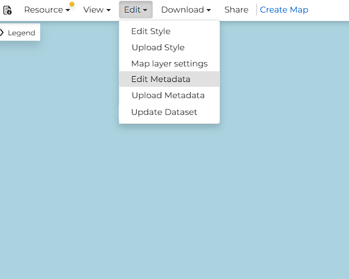
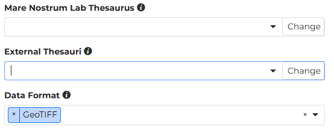
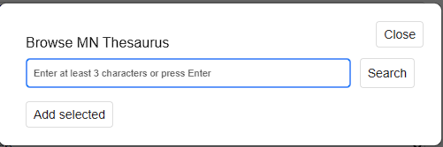
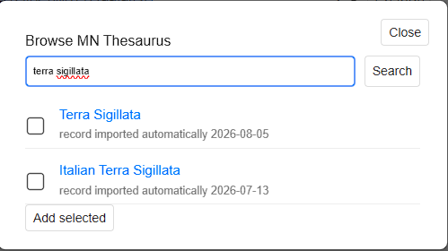

# MN Thesauri plugin

This plugin is a dedicated GeoNode app. It adds Mare Nostrum LAB thesauri (and related keyword fields) to dataset metadata. Local coordinate systems are accepted on import and transformed to GeoNode’s default web CRS (EPSG:4326 and EPSG:3857).

---

## Open metadata editing

1. Open a dataset.

1. In the top bar, open **Edit** and choose **Edit Metadata**.

    

---

## Thesauri fields on the form

The metadata form has extra sections next to the standard GeoNode fields. Each section title has an **i** icon; hover it for a short hint about what belongs in that field.

* **Mare Nostrum Lab Thesaurus** — the project’s own vocabulary (the same Wikibase as Cradle and Recogito).
* **External Thesauri** — Wikidata and World Historical Gazetteer. Assigned values look like `Nea Pafos [Wd:Q22991943]`.
* **Data Format** — technical format of the file (for example GeoTIFF). This list can also be opened with the dropdown arrow.

    

The field only shows values already assigned to the record:

* selected values appear as blue tags,
* the **x** on a tag removes that one value,
* the **x** on the right of the field (before the arrow) clears the whole field,
* the down arrow opens a short predefined list (used for **Data Format**),
* **Change** (on the right of the field) opens the search window described below.

---

## Browse the thesauri

**Change** button opens a popup to search the chosen vocabulary and add concepts. Each thesaurus field has its own **Change** button on the right.

### Empty search

The header **Browse MN Thesaurus** shows which dictionary you are querying. **Close** dismisses the window without applying a new selection.

1. Type at least three characters in the search box (placeholder: *Enter at least 3 characters or press Enter*).

    

**Add selected** stays inactive until at least one result is checked.

### Results

The list is scrollable. Each hit has a checkbox (you can pick several), a blue title link, and a short description (often *description added automatically*).

1. Check one or more concepts.

1. Press **Add selected**. The modal closes and the chosen items appear as blue tags on the form.

    

---

## Local coordinate systems

This instance accepts datasets in local / site CRS. On import, geometries are transformed to GeoNode’s default systems, EPSG:4326 and EPSG:3857. 