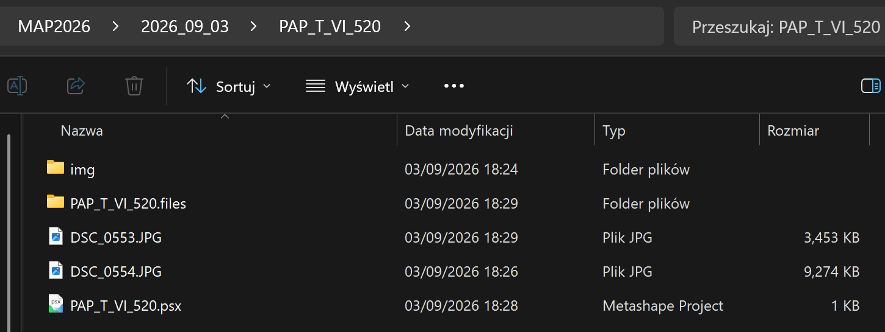
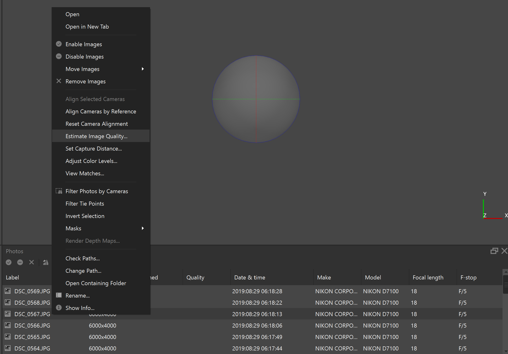
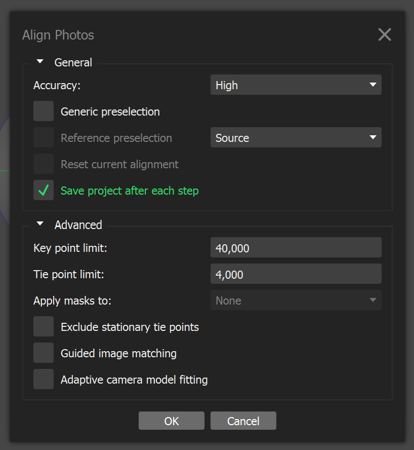

# Photogrammetric Documentation Workflow (Metashape)

## 1. Import Images

Create a directory named with the acquisition date (e.g. `2018_08_04`).

Inside this directory, create a project directory named according to the trench and context number, for example:

- `PAP_T_II_154`
- `MAL_TT_IV_186_187`

Within the project folder:

- store all photographs intended for photogrammetric processing in an `img` subdirectory,
- store additional documentary photographs separately.

---

## 2. Save the Project

Save the Metashape project using the following naming convention:

`MAL/PAP_trench_context.psx`

Example:

`PAP_T_VI_520.psx`

---

## 3. Assess Image Quality

Run: **Tools → Estimate Image Quality...**

Review a few images with the lowest quality values and identify blurred or problematic photographs.

  

Show Screenshot Hint

---

## 4. Align Images

Run: **Workflow → Align Photos...**

Recommended settings:

- **Accuracy:** High
- **Pair Preselection:** Disabled
- (Advanced) **Key point limit:** 40 000
- (Advanced) **Tie point limit:** 4 000

  

Show Screenshot Hint

??? info "Show Screenshot Hint"

    appendices/estimate_image_quality.png

---

## 5. Verify Camera Alignment

Inspect the sparse point cloud and camera positions.

Confirm that:

- camera alignment is correct,
- image orientation is logical,
- no misaligned cameras are present.

---

## 6. Detect Targets

Run:

**Tools → Markers → Detect Markers...**

Recommended settings:

- **Marker Type:** Cross (non-coded)
- **Tolerance:** 90 (or lower if necessary)

---

## 7. Assign Marker IDs

Review detected markers and assign the correct marker identifiers.

---

## 8. Import Control Point Coordinates

Import the coordinate file containing the surveyed marker coordinates.

---

## 9. Complete Missing Marker Measurements

If any markers were not detected automatically, manually place marker projections on the relevant photographs.

---

## 10. Check Georeferencing Accuracy

Verify the marker residuals and overall georeferencing quality.

A **Total Error** of approximately **1 cm (0.010 m)** or less is generally acceptable for archaeological documentation.

---

## 11. Generate Dense Point Cloud

Run:

**Workflow → Build Dense Cloud...**

Recommended settings:

- **Quality:** Low

---

## 12. Inspect the Dense Point Cloud

Check the dense point cloud for:

- gaps,
- areas with insufficient coverage,
- reconstruction artefacts.

---

## 13. Define the Reconstruction Region

If necessary, adjust the bounding box using:

**Resize Region** and **Rotate Region**

Limit the processing area to the archaeological feature or context being documented.

---

## 14. Build the Mesh

Run:

**Workflow → Build Mesh...**

Recommended settings:

- **Surface Type:** Arbitrary
- **Source Data:** Dense Cloud
- **Face Count:** Medium

---

## 15. Inspect the Mesh

Review the mesh geometry and verify that:

- the reconstructed surface accurately represents the archaeological context,
- no significant artefacts are present.

---

## 16. Build the Texture

Run:

**Workflow → Build Texture...**

Recommended settings:

- **Mapping Mode:** Generic
- **Blending Mode:** Mosaic
- **Texture Size / Count:** 4096 × 1

---

## 17. Verify Texture Quality

Inspect the textured model and check for:

- blurred areas,
- texture seams,
- colour inconsistencies,
- missing texture coverage.

The model is now ready for export and archaeological documentation.
