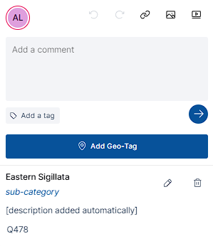

# Recogito

**[Recogito](https://recogito.mn.cenagis.edu.pl/)** is a part of the Mare Nostrum LAB system. This tool is dedicated to collaborative annotation of [TEI Texts](https://tei-c.org/), [IIIF Images](https://iiif.io/) and PDFs, built on a modern platform designed to be easy to use.

Besides its main functionalities, Recogito offers additional plugins that expand its functionality with specific types of tags. In Mare Nostrum LAB project, we offer a dedicated **Mare Nostrum Plugin** that allows the use of Mare Nostrum LAB thesaurus items as tags inside the Recogito.

To access the code repository visit [Mare Nostrum LAB GitLab](https://gitlab.cenagis.edu.pl/uavgeolab/mare-nostrum/recogito).

---

## Quick Start

### Login to Recogito

1. Visit `recogito.mn.cenagis.edu.pl` website or click [here](https://recogito.mn.cenagis.edu.pl/en/sign-in).

1. Provide your **Username** and **Password**, then click **"Sign In"** button.

    

---

### Create New Project

???+ note "User priviledges"
    To create a new project, you need to have a proper organization role, which means having a `Professor` or `Admin` role. Further information can be found [here](appendices.md/#recogito-studio-roles).

1. [Login to Recogito Studio](#login-to-recogito-studio).

1. Press a **"New Project"** button in the top right corner of the page.

    

1. Provide the project name and description, set projects properties, and press the **"Create"** button.

    ???+ note "Project properties - Project Visibility"
        You can select two options in Project Visibility section:

        - **Private** - project is visible only to the admin and users who join after receiving an admin invitation.
        - **Public** - any registered user can access the project by visiting the **"Public Projects"** section.

    ???+ note "Project properties - Project Type"
        You can select two options in Project Type section:

        - **Assignments** - project admins create assignments with specific documents, and team members fulfil the given tasks.
        - **Single Team** - project members can annotate any document.

    

1. Upon creating, an empty project page will be displayed. 

    

---

### Add New Document

1. [Create](#create-new-project) or open a project.

1. Press the **"Add Document"** button in the top right corner.

    

1. Press the **"Import"** button and select a file from your device or provide a IIIF manifest.

    

1. (Optional) Go to the **"All documents"** section and select documents of interest from the list of publicly available ones across the organization.

    

1. Wait for processing, which ends with a confirmation message and a new document object.

    ???+ note
        To inspect the document from the adding panel, you need to refresh the page by hand.

    

---

### Annotate TEI Texts and PDF Files

???+ note "Inspect annotations"
    You can inspect existing annotations by opening a dedicated pane on the right side of the page.

1. Choose and open a TEI or PDF document.

1. Mark the pieces of text you want to annotate, provide content for the annotation, and save them.

    ???+ note
        You can add tags to create thematic groups for the annotations.

    ???+ note
        You can add Web URL links, Image URL links and YouTube links to your annotation.

    

---

### Annotate IIIF, JPG and PNG Images

???+ note "Inspect annotations"
    You can inspect existing annotations by opening a dedicated pane on the right side of the page.

1. Choose and open a IIIF, JPG or PNG image.

1. Select the rectangular or multiangular marking mode, outline the elements of interest, provide annotation contents, and save.

    ???+ note
        You can add tags to create thematic groups for the annotations.

    ???+ note
        You can add Web URL links, Image URL links and YouTube links to your annotation.

    

---

### Add Geotagger Plugin to Your Project

???+ note "Plugins availability"
    Note that plugins are available per project. This means you need to enable them in each project independently.

1. To enable a plugin, open a project as a **Project Admin**.

1. Go to **"Settings"**.

    

1. Next, press the **"Plugins"** tab, click the **"Browse Available Plugins"** button and install the listed plugin.

    

1. Add gazetteers and save the settings.

    ???+ note "Plugin limitations"
        Unfortunatelly, the Core Data gazetteer does not work properly. Including it in your project may cause plugin instabilities.

    

1. Verify the plugin installation by visiting the project and trying to add an annotation with a geotag.

    

1. After providing a string of characters, you can confirm automatically suggested tag or change it in the dedicated window.

    

---

### Mare Nostrum LAB thesaurus plugin
???+ note "Plugins availability"
    Plugins are available per project. Enable them in each project independently.

1. Open a project as a **Project Admin**.

1. Go to **"Settings"**.

    

1. Open the **"Plugins"** tab, click **"Browse Available Plugins"**, and install **Mare Nostrum Lab Thesaurus**.

    

1. In the plugin settings, choose which dictionaries are searchable (amphora type, vessel form, chronology, material, and the rest of the MN vocabularies). Optionally keep **Use selected annotation text as the thesaurus search query** enabled.

    

1. Open a document, create or select an annotation, and click **"Add Mare Nostrum LAB thesaurus tag"**.

    

1. Search for a concept. Results show the label, dictionary type, description, and thesaurus id.

    

1. Select a result. The tag is stored on the annotation and links to the concept in the [Mare Nostrum LAB thesaurus](https://thesaurus.mn.cenagis.edu.pl).

    
